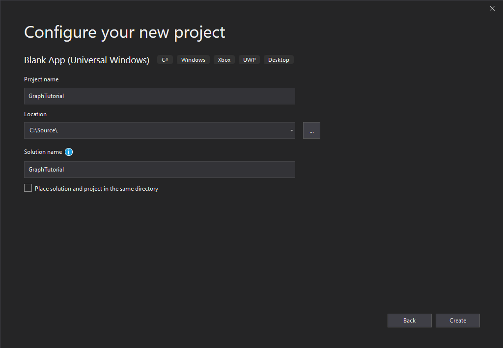

<!-- markdownlint-disable MD002 MD041 -->

In diesem Abschnitt erstellen Sie eine neue UWP-app.

1. Öffnen Sie Visual Studio, und wählen Sie **Neues Projekt erstellen**. Wählen Sie die Option **leere app (universelle Windows)** aus, die C# verwendet, und wählen Sie dann **weiter**aus.

    

1. Geben Sie im Dialogfeld **Neues Projekt konfigurieren** in `GraphTutorial` das Feld **Projektname** ein, und wählen Sie dann **Erstellen**aus.

    

    > [!IMPORTANT]
    > Stellen Sie sicher, dass Sie genau den gleichen Namen für das Visual Studio Projekt eingeben, das in diesen Übungseinheiten angegeben ist. Der Visual Studio-Projektname wird Teil des Namespace im Code. Der Code in diesen Anweisungen hängt vom Namespace ab, der mit dem in diesen Anweisungen angegebenen Visual Studio-Projektnamen übereinstimmt. Wenn Sie einen anderen Projektnamen verwenden, wird der Code nicht kompiliert, es sei denn, Sie passen alle Namespaces so an, dass Sie dem von Ihnen beim Erstellen des Projekts eingegebenen Visual Studio-Projektnamen entsprechen.

1. Wählen Sie **OK** aus. Stellen Sie im Dialogfeld **Neues universelles Windows-Platt Form Projekt** sicher, dass die `Windows 10, Version 1809 (10.0; Build 17763)` **minimale Version** auf oder höher festgelegt ist, und wählen Sie **OK**aus.

## <a name="install-nuget-packages"></a>Installieren der NuGet-Pakete

Bevor Sie fortfahren, installieren Sie einige zusätzliche NuGet-Pakete, die Sie später verwenden werden.

- [Microsoft. Toolkit. UWP. UI. Controls](https://www.nuget.org/packages/Microsoft.Toolkit.Uwp.Ui.Controls/) zum Hinzufügen einiger UI-Steuerelemente für in-App-Benachrichtigungen und lade Indikatoren.
- [Microsoft. Toolkit. UWP. UI. Controls. DataGrid](https://www.nuget.org/packages/Microsoft.Toolkit.Uwp.Ui.Controls.DataGrid/) zum Anzeigen der von Microsoft Graph zurückgegebenen Informationen.
- [Microsoft. Toolkit. Graph. Controls](https://www.nuget.org/packages/Microsoft.Toolkit.Graph.Controls) zum Behandeln von Anmelde-und Zugriffstoken abrufen.

1. Wählen Sie **Extras > NuGet-Paket-Manager > Paket-Manager-Konsole**aus. Geben Sie in der Paket-Manager-Konsole die folgenden Befehle ein:

    ```powershell
    Install-Package Microsoft.Toolkit.Uwp.Ui.Controls -Version 6.0.0
    Install-Package Microsoft.Toolkit.Uwp.Ui.Controls.DataGrid -Version 6.0.0
    Install-Package Microsoft.Toolkit.Graph.Controls -IncludePrerelease
    ```

## <a name="design-the-app"></a>Entwerfen der App

In diesem Abschnitt erstellen Sie die Benutzeroberfläche für die app.

1. Fügen Sie zunächst eine Variable auf Anwendungsebene hinzu, um den Authentifizierungsstatus nachzuverfolgen. Erweitern Sie im Projektmappen-Explorer den Knoten **app. XAML** , und öffnen Sie **app.XAML.cs**. Fügen Sie der `App`-Klasse die folgende Eigenschaft hinzu.

    ```csharp
    public bool IsAuthenticated { get; set; }
    ```

1. Definieren Sie das Layout für die Hauptseite. Öffnen `MainPage.xaml` Sie den gesamten Inhalt, und ersetzen Sie ihn durch Folgendes.

    :::code language="xaml" source="../demo/GraphTutorial/MainPage.xaml" id="MainPageXamlSnippet":::

    Dies definiert eine grundlegende [NavigationView](/uwp/api/windows.ui.xaml.controls.navigationview) mit **Start** -und **Kalender** Navigationslinks, die als Hauptansicht der APP fungieren. Außerdem wird ein [LoginButton](https://github.com/windows-toolkit/Graph-Controls) -Steuerelement in der Kopfzeile der Ansicht hinzugefügt. Mit diesem Steuerelement kann sich der Benutzer an-und abmelden. Das Steuerelement ist noch nicht vollständig aktiviert, Sie werden es in einer späteren Übung konfigurieren.

1. Klicken Sie mit der rechten Maustaste auf das **Graph-Tutorial-** Projekt im Projektmappen-Explorer, und wählen Sie **> neues Element hinzufügen aus...**. Wählen Sie **leere Seite**aus `HomePage.xaml` , geben Sie in das Feld **Name** ein, und wählen Sie **Hinzufügen**aus. Ersetzen Sie das `<Grid>` vorhandene Element in der Datei durch Folgendes.

    :::code language="xaml" source="../demo/GraphTutorial/HomePage.xaml" id="HomePageGridSnippet" highlight="2-5":::

1. Erweitern Sie Haupt **. XAML** im Projektmappen `MainPage.xaml.cs`-Explorer, und öffnen Sie. Fügen Sie der `MainPage` Klasse die folgende Funktion hinzu, um den Authentifizierungsstatus zu verwalten.

    :::code language="csharp" source="../demo/GraphTutorial/MainPage.xaml.cs" id="SetAuthStateSnippet":::

1. Fügen Sie dem `MainPage()` Konstruktor **nach** der `this.InitializeComponent();` -Verbindung den folgenden Code hinzu.

    ```csharp
    // Initialize auth state to false
    SetAuthState(false);

    // Configure MSAL provider
    // TEMPORARY
    MsalProvider.ClientId = "11111111-1111-1111-1111-111111111111";

    // Navigate to HomePage.xaml
    RootFrame.Navigate(typeof(HomePage));
    ```

    Wenn die APP erstmalig gestartet wird, wird der Authentifizierungsstatus in `false` initialisiert und zur Startseite navigiert.

1. Fügen Sie den folgenden Ereignishandler hinzu, um die angeforderte Seite zu laden, wenn der Benutzer ein Element aus der Navigationsansicht auswählt.

    ```csharp
    private void NavView_ItemInvoked(NavigationView sender, NavigationViewItemInvokedEventArgs args)
    {
        var invokedItem = args.InvokedItem as string;

        switch (invokedItem.ToLower())
        {
            case "calendar":
                throw new NotImplementedException();
                break;
            case "home":
            default:
                RootFrame.Navigate(typeof(HomePage));
                break;
        }
    }
    ```

1. Speichern Sie alle Änderungen, drücken Sie **F5** , oder wählen Sie **Debug > starten des Debuggings** in Visual Studio.

    > [!NOTE]
    > Stellen Sie sicher, dass Sie die entsprechende Konfiguration für Ihren Computer auswählen (Arm, x64, x86).

    
