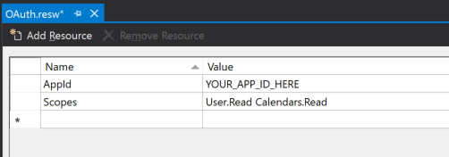

<!-- markdownlint-disable MD002 MD041 -->

<span data-ttu-id="016f3-101">In dieser Übung erweitern Sie die Anwendung aus der vorherigen Übung, um die Authentifizierung mit Azure AD zu unterstützen.</span><span class="sxs-lookup"><span data-stu-id="016f3-101">In this exercise you will extend the application from the previous exercise to support authentication with Azure AD.</span></span> <span data-ttu-id="016f3-102">Dies ist erforderlich, um das erforderliche OAuth-Zugriffstoken zum Aufrufen von Microsoft Graph zu erhalten.</span><span class="sxs-lookup"><span data-stu-id="016f3-102">This is required to obtain the necessary OAuth access token to call the Microsoft Graph.</span></span> <span data-ttu-id="016f3-103">In diesem Schritt werden Sie das [AadLogin](https://docs.microsoft.com/dotnet/api/microsoft.toolkit.uwp.ui.controls.graph.aadlogin?view=win-comm-toolkit-dotnet-stable) -Steuerelement aus dem [Windows Community Toolkit](https://github.com/Microsoft/WindowsCommunityToolkit) in die Anwendung integrieren.</span><span class="sxs-lookup"><span data-stu-id="016f3-103">In this step you will integrate the [AadLogin](https://docs.microsoft.com/dotnet/api/microsoft.toolkit.uwp.ui.controls.graph.aadlogin?view=win-comm-toolkit-dotnet-stable) control from the [Windows Community Toolkit](https://github.com/Microsoft/WindowsCommunityToolkit) into the application.</span></span>

<span data-ttu-id="016f3-104">Klicken Sie mit der rechten Maustaste auf das **Graph-Tutorial-** Projekt im Projektmappen-Explorer, und wählen Sie **#a0 neues Element hinzufügen aus...**. Wählen Sie **Ressourcendatei (. resw)**, benennen Sie `OAuth.resw` die Datei, und wählen Sie **Hinzufügen**aus.</span><span class="sxs-lookup"><span data-stu-id="016f3-104">Right-click the **graph-tutorial** project in Solution Explorer and select **Add > New Item...**. Choose **Resources File (.resw)**, name the file `OAuth.resw` and select **Add**.</span></span> <span data-ttu-id="016f3-105">Wenn die neue Datei in Visual Studio geöffnet wird, erstellen Sie zwei Ressourcen wie folgt.</span><span class="sxs-lookup"><span data-stu-id="016f3-105">When the new file opens in Visual Studio, create two resources as follows.</span></span>

- <span data-ttu-id="016f3-106">**Name:** `AppId`, **Wert:** die APP-ID, die Sie im Anwendungs Registrierungs Portal generiert haben.</span><span class="sxs-lookup"><span data-stu-id="016f3-106">**Name:** `AppId`, **Value:** the app ID you generated in Application Registration Portal</span></span>
- <span data-ttu-id="016f3-107">**Name:** `Scopes`, **Wert:**`User.Read Calendars.Read`</span><span class="sxs-lookup"><span data-stu-id="016f3-107">**Name:** `Scopes`, **Value:** `User.Read Calendars.Read`</span></span>



> [!IMPORTANT]
> <span data-ttu-id="016f3-109">Wenn Sie die Quellcodeverwaltung wie git verwenden, wäre es jetzt ein guter Zeitpunkt, die Datei `OAuth.resw` aus der Quellcodeverwaltung auszuschließen, um unbeabsichtigtes Auslaufen ihrer APP-ID zu vermeiden.</span><span class="sxs-lookup"><span data-stu-id="016f3-109">If you're using source control such as git, now would be a good time to exclude the `OAuth.resw` file from source control to avoid inadvertently leaking your app ID.</span></span>

## <a name="configure-the-aadlogin-control"></a><span data-ttu-id="016f3-110">Konfigurieren des AadLogin-Steuerelements</span><span class="sxs-lookup"><span data-stu-id="016f3-110">Configure the AadLogin control</span></span>

<span data-ttu-id="016f3-111">Beginnen Sie mit dem Hinzufügen von Code, um die Werte aus der Ressourcendatei zu lesen.</span><span class="sxs-lookup"><span data-stu-id="016f3-111">Start by adding code to read the values out of the resources file.</span></span> <span data-ttu-id="016f3-112">Öffnen `MainPage.xaml.cs` Sie und fügen Sie `using` die folgende Anweisung am Anfang der Datei hinzu.</span><span class="sxs-lookup"><span data-stu-id="016f3-112">Open `MainPage.xaml.cs` and add the following `using` statement to the top of the file.</span></span>

```cs
using Microsoft.Toolkit.Services.MicrosoftGraph;
```

<span data-ttu-id="016f3-113">Ersetzen Sie die Zeile `RootFrame.Navigate(typeof(HomePage));` durch den folgenden Code.</span><span class="sxs-lookup"><span data-stu-id="016f3-113">Replace the `RootFrame.Navigate(typeof(HomePage));` line with the following code.</span></span>

```cs
// Load OAuth settings
var oauthSettings = Windows.ApplicationModel.Resources.ResourceLoader.GetForCurrentView("OAuth");
var appId = oauthSettings.GetString("AppId");
var scopes = oauthSettings.GetString("Scopes");

if (string.IsNullOrEmpty(appId) || string.IsNullOrEmpty(scopes))
{
    Notification.Show("Could not load OAuth Settings from resource file.");
}
else
{
    // Initialize Graph
    MicrosoftGraphService.Instance.AuthenticationModel = MicrosoftGraphEnums.AuthenticationModel.V2;
    MicrosoftGraphService.Instance.Initialize(appId,
        MicrosoftGraphEnums.ServicesToInitialize.UserProfile,
        scopes.Split(' '));

    // Navigate to HomePage.xaml
    RootFrame.Navigate(typeof(HomePage));
}
```

<span data-ttu-id="016f3-114">Dieser Code lädt die Einstellungen aus `OAuth.resw` und initialisiert die globale Instanz von `MicrosoftGraphService` mit diesen Werten.</span><span class="sxs-lookup"><span data-stu-id="016f3-114">This code loads the settings from `OAuth.resw` and initializes the global instance of the `MicrosoftGraphService` with those values.</span></span>

<span data-ttu-id="016f3-115">Fügen Sie nun einen Ereignishandler für `SignInCompleted` das Ereignis für `AadLogin` das Steuerelement hinzu.</span><span class="sxs-lookup"><span data-stu-id="016f3-115">Now add an event handler for the `SignInCompleted` event on the `AadLogin` control.</span></span> <span data-ttu-id="016f3-116">Öffnen Sie `MainPage.xaml` die Datei, und ersetzen `<graphControls:AadLogin>` Sie das vorhandene Element durch Folgendes.</span><span class="sxs-lookup"><span data-stu-id="016f3-116">Open the `MainPage.xaml` file and replace the existing `<graphControls:AadLogin>` element with the following.</span></span>

```xml
<graphControls:AadLogin x:Name="Login"
    HorizontalAlignment="Left"
    View="SmallProfilePhotoLeft"
    AllowSignInAsDifferentUser="False"
    SignInCompleted="Login_SignInCompleted"
    SignOutCompleted="Login_SignOutCompleted"
    />
```

<span data-ttu-id="016f3-117">Fügen Sie dann die folgenden Funktionen zur `MainPage` Klasse in `MainPage.xaml.cs`hinzu.</span><span class="sxs-lookup"><span data-stu-id="016f3-117">Then add the following functions to the `MainPage` class in `MainPage.xaml.cs`.</span></span>

```cs
private void Login_SignInCompleted(object sender, Microsoft.Toolkit.Uwp.UI.Controls.Graph.SignInEventArgs e)
{
    // Set the auth state
    SetAuthState(true);
    // Reload the home page
    RootFrame.Navigate(typeof(HomePage));
}

private void Login_SignOutCompleted(object sender, EventArgs e)
{
    // Set the auth state
    SetAuthState(false);
    // Reload the home page
    RootFrame.Navigate(typeof(HomePage));
}
```

<span data-ttu-id="016f3-118">Erweitern Sie schließlich im Projektmappen-Explorer **Homepage. XAML** , und öffnen `HomePage.xaml.cs`Sie.</span><span class="sxs-lookup"><span data-stu-id="016f3-118">Finally, in Solution Explorer, expand **HomePage.xaml** and open `HomePage.xaml.cs`.</span></span> <span data-ttu-id="016f3-119">Fügen Sie den folgenden Code nach `this.InitializeComponent();` der Codezeile hinzu.</span><span class="sxs-lookup"><span data-stu-id="016f3-119">Add the following code after the `this.InitializeComponent();` line.</span></span>

```cs
if ((App.Current as App).IsAuthenticated)
{
    HomePageMessage.Text = "Welcome! Please use the menu to the left to select a view.";
}
```

<span data-ttu-id="016f3-120">Starten Sie die APP neu, und klicken Sie oben in der APP auf das **Anmelde** Steuerelement.</span><span class="sxs-lookup"><span data-stu-id="016f3-120">Restart the app and click the **Sign In** control at the top of the app.</span></span> <span data-ttu-id="016f3-121">Nachdem Sie sich angemeldet haben, sollte die Benutzeroberfläche geändert werden, um anzugeben, dass Sie sich erfolgreich angemeldet haben.</span><span class="sxs-lookup"><span data-stu-id="016f3-121">Once you've signed in, the UI should change to indicate that you've successfully signed-in.</span></span>


> [!NOTE]
> <span data-ttu-id="016f3-123">Das `AadLogin` Steuerelement implementiert die Logik des Speicherns und Aktualisierens des Zugriffstokens für Sie.</span><span class="sxs-lookup"><span data-stu-id="016f3-123">The `AadLogin` control implements the logic of storing and refreshing the access token for you.</span></span> <span data-ttu-id="016f3-124">Die Token werden im sicheren Speicher gespeichert und bei Bedarf aktualisiert.</span><span class="sxs-lookup"><span data-stu-id="016f3-124">The tokens are stored in secure storage and refreshed as needed.</span></span>
