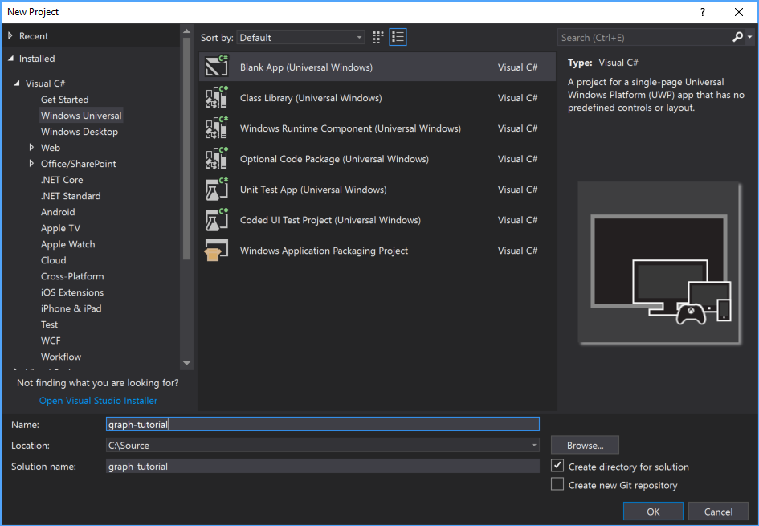

<!-- markdownlint-disable MD002 MD041 -->

Öffnen Sie Visual Studio, und wählen Sie **Datei _GT_ neues >-Projekt**aus. Führen Sie im Dialogfeld **Neues Projekt** folgende Aktionen aus:

1. Wählen Sie **Vorlagen _GT_ Visual C# _GT_ Windows Universal**aus.
1. Wählen Sie **leere app (universelle Fenster)** aus.
1. Geben Sie **Graph-Tutorial** als Namen für das Projekt ein.



> [!IMPORTANT]
> Stellen Sie sicher, dass Sie genau denselben Namen für das Visual Studio-Projekt eingeben, das in diesen Lab-Anweisungen angegeben ist. Der Visual Studio-Projektname wird Teil des Namespaces im Code. Der Code in diesen Anweisungen hängt vom Namespace ab, der dem in diesen Anweisungen angegebenen Visual Studio-Projektnamen entspricht. Wenn Sie einen anderen Projektnamen verwenden, wird der Code nicht kompiliert, es sei denn, Sie passen alle Namespaces so an, dass Sie mit dem Visual Studio-Projektnamen übereinstimmen, den Sie beim Erstellen des Projekts eingeben.

Wählen Sie **OK** aus. Stellen Sie im Dialogfeld **neues Windows-Platt Form Projekt** sicher **** , dass die Mindestversion `Windows 10 Fall Creators Update (10.0; Build 16299)` auf oder höher festgelegt ist, und wählen Sie **OK**aus.

Bevor Sie fortfahren, installieren Sie einige zusätzliche NuGet-Pakete, die Sie später verwenden werden.

- [Microsoft. Toolkit. UWP. UI. Controls](https://www.nuget.org/packages/Microsoft.Toolkit.Uwp.Ui.Controls/) zum Hinzufügen einiger UI-Steuerelemente für in-App-Benachrichtigungen und lade Indikatoren.
- [Microsoft. Toolkit. UWP. UI. Controls. DataGrid](https://www.nuget.org/packages/Microsoft.Toolkit.Uwp.Ui.Controls.DataGrid/) , um die von Microsoft Graph zurückgegebenen Informationen anzuzeigen.
- [Microsoft. Toolkit. UWP. UI. Controls. Graph](https://www.nuget.org/packages/Microsoft.Toolkit.Uwp.Ui.Controls.Graph/) , um den Anmelde-und Zugriffstoken Abruf zu behandeln.
- [Microsoft. Graph](https://www.nuget.org/packages/Microsoft.Graph/) für Aufrufe von Microsoft Graph.

Wählen Sie **Extras _GT_ NuGet Paket-Manager _GT_ Paket-Manager-Konsole**aus. Geben Sie in der Paket-Manager-Konsole die folgenden Befehle ein.

```Powershell
Install-Package Microsoft.Toolkit.Uwp.Ui.Controls
Install-Package Microsoft.Toolkit.Uwp.Ui.Controls.DataGrid
Install-Package Microsoft.Toolkit.Uwp.Ui.Controls.Graph
Install-Package Microsoft.Graph
```

## <a name="design-the-app"></a>Entwerfen der APP

Beginnen Sie, indem Sie eine Variable auf Anwendungsebene hinzufügen, um den Authentifizierungsstatus nachzuverfolgen. Erweitern Sie im Projektmappen-Explorer **app. XAML** , und öffnen Sie **app.XAML.cs**. Fügen Sie der `App` Klasse die folgende Eigenschaft hinzu.

```cs
public bool IsAuthenticated { get; set; }
```

Definieren Sie als nächstes das Layout für die Hauptseite. Öffnen `MainPage.xaml` Sie den gesamten Inhalt, und ersetzen Sie ihn durch Folgendes.

```xml
<Page
    x:Class="graph_tutorial.MainPage"
    xmlns="http://schemas.microsoft.com/winfx/2006/xaml/presentation"
    xmlns:x="http://schemas.microsoft.com/winfx/2006/xaml"
    xmlns:local="using:graph_tutorial"
    xmlns:d="http://schemas.microsoft.com/expression/blend/2008"
    xmlns:mc="http://schemas.openxmlformats.org/markup-compatibility/2006"
    xmlns:controls="using:Microsoft.Toolkit.Uwp.UI.Controls"
    xmlns:graphControls="using:Microsoft.Toolkit.Uwp.UI.Controls.Graph"
    mc:Ignorable="d"
    Background="{ThemeResource ApplicationPageBackgroundThemeBrush}">

    <Grid>
        <NavigationView x:Name="NavView"
            IsSettingsVisible="False"
            ItemInvoked="NavView_ItemInvoked">

            <NavigationView.Header>
                <graphControls:AadLogin x:Name="Login"
                    HorizontalAlignment="Left"
                    View="SmallProfilePhotoLeft"
                    AllowSignInAsDifferentUser="False"
                    />
            </NavigationView.Header>

            <NavigationView.MenuItems>
                <NavigationViewItem Content="Home" x:Name="Home" Tag="home">
                    <NavigationViewItem.Icon>
                        <FontIcon Glyph="&#xE10F;"/>
                    </NavigationViewItem.Icon>
                </NavigationViewItem>
                <NavigationViewItem Content="Calendar" x:Name="Calendar" Tag="calendar">
                    <NavigationViewItem.Icon>
                        <FontIcon Glyph="&#xE163;"/>
                    </NavigationViewItem.Icon>
                </NavigationViewItem>
            </NavigationView.MenuItems>

            <StackPanel>
                <controls:InAppNotification x:Name="Notification" ShowDismissButton="true" />
                <Frame x:Name="RootFrame" Margin="24, 0" />
            </StackPanel>
        </NavigationView>
    </Grid>
</Page>
```

Dies definiert eine grundlegende [NavigationView](https://docs.microsoft.com/uwp/api/windows.ui.xaml.controls.navigationview) mit **Start** -und **Kalender** Navigationslinks, die als Hauptansicht der APP fungieren. Außerdem wird ein [AadLogin](https://docs.microsoft.com/dotnet/api/microsoft.toolkit.uwp.ui.controls.graph.aadlogin?view=win-comm-toolkit-dotnet-stable) -Steuerelement in der Kopfzeile der Ansicht hinzugefügt. Dieses Steuerelement ermöglicht es dem Benutzer, sich anzumelden. Das Steuerelement ist noch nicht vollständig aktiviert, Sie werden es in einer späteren Übung konfigurieren.

Fügen Sie nun eine weitere XAML-Seite für die Startansicht hinzu. Klicken Sie im projektMappen-Explorer mit der rechten Maustaste auf das **Graph-Tutorial-** Projekt, und wählen Sie **_GT_ neues Element hinzufügen...**. Wählen Sie **leere Seite**aus `HomePage.xaml` , geben Sie in das Feld **Name** ein, und wählen Sie **Hinzufügen**aus. Fügen Sie den folgenden Code innerhalb `<Grid>` des-Elements in der Datei hinzu.

```xml
<StackPanel>
    <TextBlock FontSize="44" FontWeight="Bold" Margin="0, 12">Microsoft Graph UWP Tutorial</TextBlock>
    <TextBlock x:Name="HomePageMessage">Please sign in to continue.</TextBlock>
</StackPanel>
```

Erweitern Sie nun "Haupt **. XAML** " im Projekt `MainPage.xaml.cs`Mappen-Explorer und öffnen. Fügen Sie dem `MainPage()` Konstruktor **nach** der `this.InitializeComponent();` Leitung den folgenden Code hinzu.

```cs
// Initialize auth state to false
SetAuthState(false);

// Navigate to HomePage.xaml
RootFrame.Navigate(typeof(HomePage));
```

Wenn die APP zum ersten Mal gestartet wird, initialisiert Sie den Authentifizierungsstatus `false` und wechselt zur Homepage.

Fügen Sie der `MainPage` Klasse die folgende Funktion hinzu, um den Authentifizierungsstatus zu verwalten.

```cs
private void SetAuthState(bool isAuthenticated)
{
    (App.Current as App).IsAuthenticated = isAuthenticated;

    // Toggle controls that require auth
    Calendar.IsEnabled = isAuthenticated;
}
```

Fügen Sie den folgenden Ereignishandler hinzu, um die angeforderte Seite zu laden, wenn der Benutzer ein Element aus der Navigationsansicht auswählt.

```cs
private void NavView_ItemInvoked(NavigationView sender, NavigationViewItemInvokedEventArgs args)
{
    var invokedItem = args.InvokedItem as string;

    switch (invokedItem.ToLower())
    {
        case "calendar":
            throw new NotImplementedException();
            break;
        case "home":
        default:
            RootFrame.Navigate(typeof(HomePage));
            break;
    }
}
```

Speichern Sie alle Änderungen, und drücken Sie **F5** , oder wählen Sie **Debug > Start Debugging** in Visual Studio.

> [!NOTE]
> Stellen Sie sicher, dass Sie die entsprechende Konfiguration für Ihren Computer (ARM, x64, x86) ausgewählt haben.


