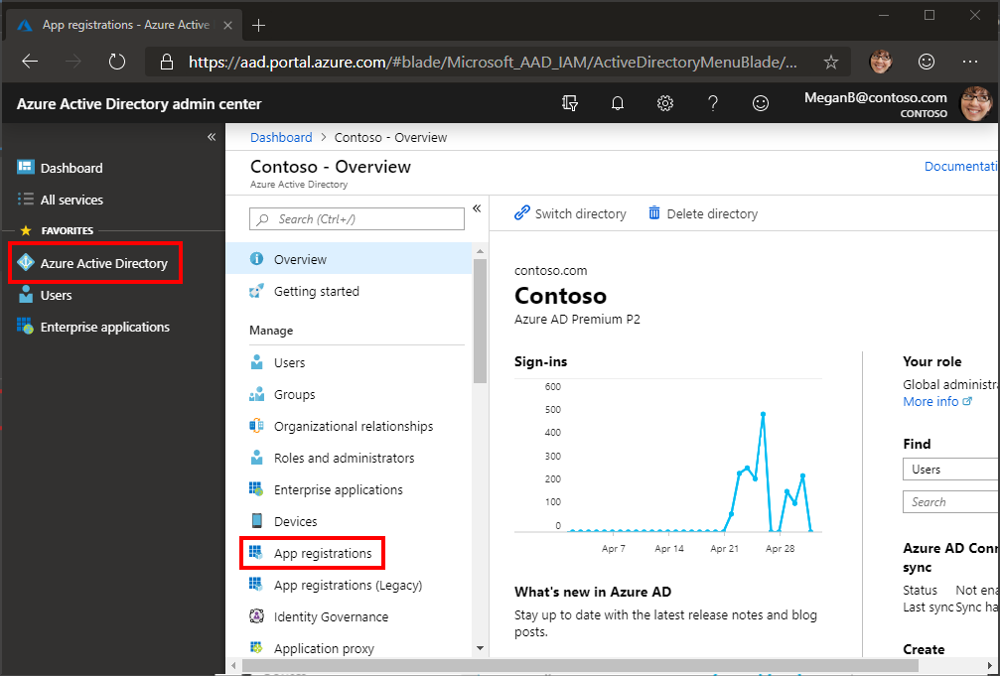
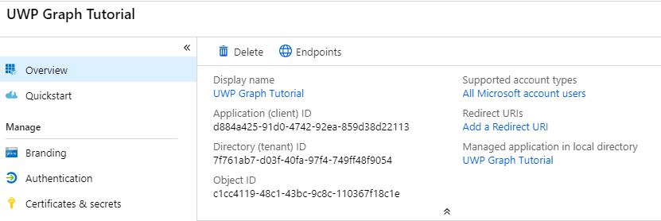

<!-- markdownlint-disable MD002 MD041 -->

In dieser Übung erstellen Sie eine neue Azure AD native-Anwendung mithilfe des Azure Active Directory Admin Center.In this exercise you will create a new Azure AD native application using the Azure Active Directory admin center.

1. Öffnen Sie einen Browser, und navigieren Sie zum [Azure Active Directory Admin Center](https://aad.portal.azure.com) , und melden Sie sich mit einem **persönlichen Konto** (aka: Microsoft-Konto) oder einem Geschäfts- **oder Schulkonto**an.Open a browser and navigate to the [Azure Active Directory admin center](https://aad.portal.azure.com) and login using a **personal account** (aka: Microsoft Account) or **Work or School Account**.

1. Wählen Sie **Azure Active Directory** in der linken Navigationsleiste aus, und wählen Sie dann **App-Registrierungen (Vorschau)** unter **Manage**aus.Select **Azure Active Directory** in the left-hand navigation, then select **App registrations (Preview)** under **Manage**.

    

1. Wählen Sie **neue Registrierung**aus.Select **New registration**. Legen Sie auf der Seite **Anwendung registrieren** die Werte wie folgt fest.On the **Register an application** page, set the values as follows.

    - Legen \*\*\*\* Sie Name `UWP Graph Tutorial`auf fest.Set **Name** to `UWP Graph Tutorial`.
    - Legen Sie **unterstützte Kontotypen** auf **Konten in einem beliebigen Organisations Verzeichnis und persönlichen Microsoft-Konten**fest.Set **Supported account types** to **Accounts in any organizational directory and personal Microsoft accounts**.
    - Lassen Sie den umLeitungs- **URI** leer.Leave **Redirect URI** empty.

    

1. Wählen Sie **registrieren**aus.Choose **Register**. Kopieren Sie auf der Seite **UWP Graph Tutorial** den Wert der **Anwendungs-ID (Client)** , und speichern Sie ihn, dann benötigen Sie ihn im nächsten Schritt.On the **UWP Graph Tutorial** page, copy the value of the **Application (client) ID** and save it, you will need it in the next step.

    

1. Wählen Sie den Link umLeitungs- **URI hinzufügen** aus.Select the **Add a Redirect URI** link. Suchen Sie auf der Seite **URIs umleiten** nach dem Abschnitt Empfohlene Umleitungs- **URIs für öffentliche Clients (Mobil, Desktop)** .On the **Redirect URIs** page, locate the **Suggested Redirect URIs for public clients (mobile, desktop)** section. Wählen Sie `urn:ietf:wg:oauth:2.0:oob` den URI aus, und klicken Sie dann auf **Speichern**.Select the `urn:ietf:wg:oauth:2.0:oob` URI, then choose **Save**.

    